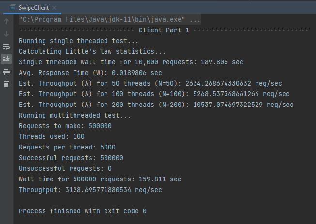
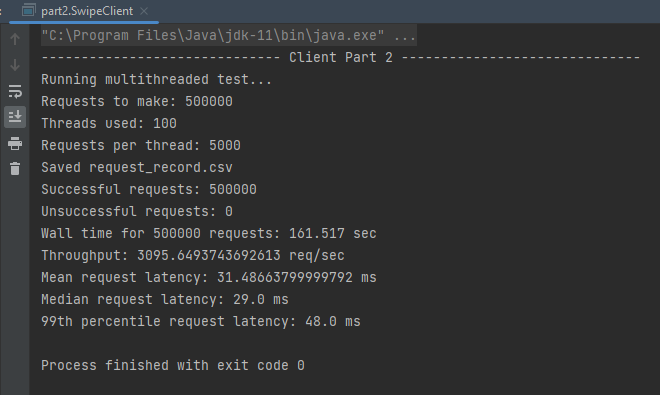

# CS6650 - Assignment 1

<b>Instructor:</b> Vishal Rajpal

<b>Student:</b> Jake Van Meter

<b>Note to grader:</b> I made extensive use of static nested classes for this
assignment. I was exposed to this design practice recently and wanted to try
it out for this assignment to see if it would make namespace organization easier.
If you don't agree with that practice, no problem. Just wanted to let you know
it was intentional.

## Running the Program

1) Change the value of the `public static String URL` constant in the `utils.UC`
class to the base URL of the target servlet.
2) Run either `part1.SwipeClient`'s `main` method  or `part2.SwipeClient`'s
`main` method.

## Client Part 1 Output

## Client Part 2 Output

## Graph of Throughput Over Time

## Reflections

Looking at the predictions made by Little's law in part 1, we see that
the estimated throughput for 100 threads was about 5268 requests per second.
This does not match my `SwipeClient` implemenation results which, in
this particular run with 100 threads, only achieved a throughput of about
3128 requests per second for part 1 (about 59% of prediction) and about 
3095 requests per second for part 2 (about 59% of prediction). This 
relative difference between the prediction and reality remained mostly
consistent through mutliple tests.

However, When looking at the results for 50 threads (the image of which can 
be found in images/p1_50_thrds.png) the real throughput was about 70% of 
little's law prediction. Moreover, for 200 threads, the real throughput was
about 30% of little's law predition (found in images/p1_200_thrds.png).

This large difference could be at least partly due to too much
serialization in my implementation. However, it is also at least partly due
to the hardware limitations of both my system (6 cores) and the EC2 
instance (1 core).

Therefore, we can see that if hardware resources remain constant, throughput
increases increases exponentially relative to the number of threads in a system.
