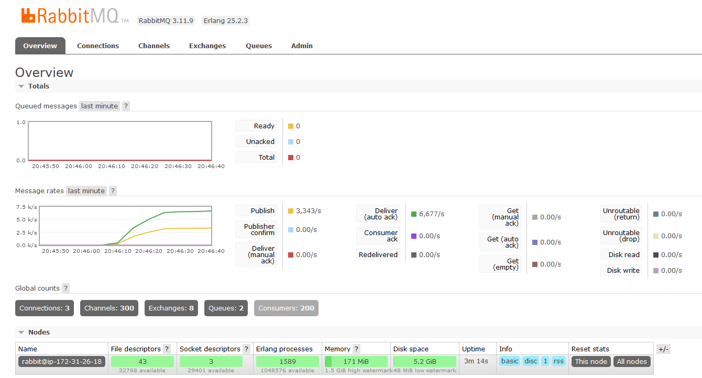
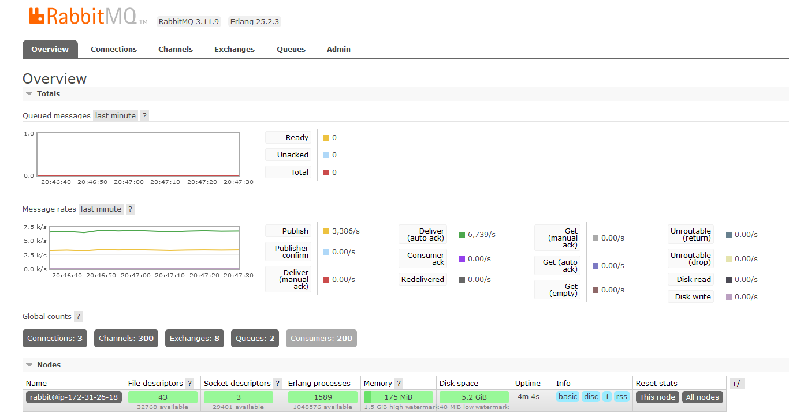
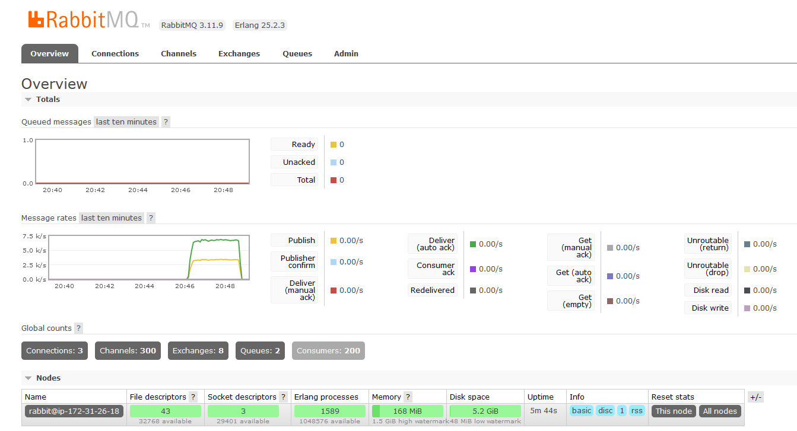
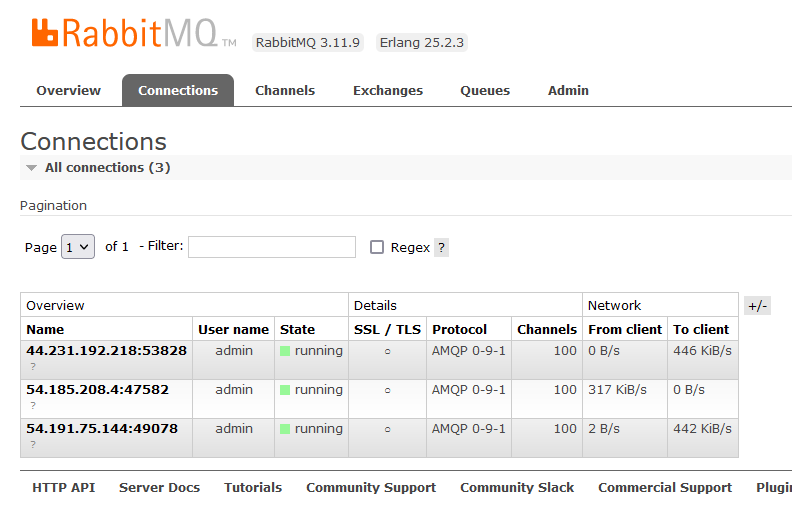
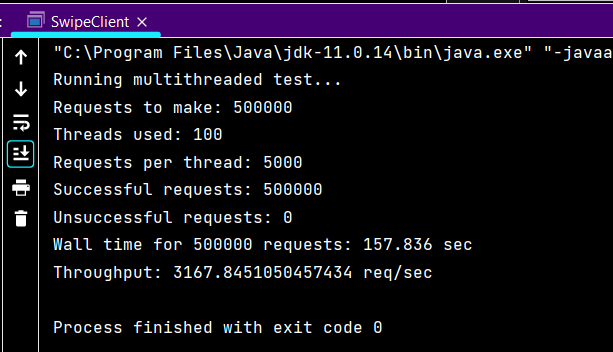
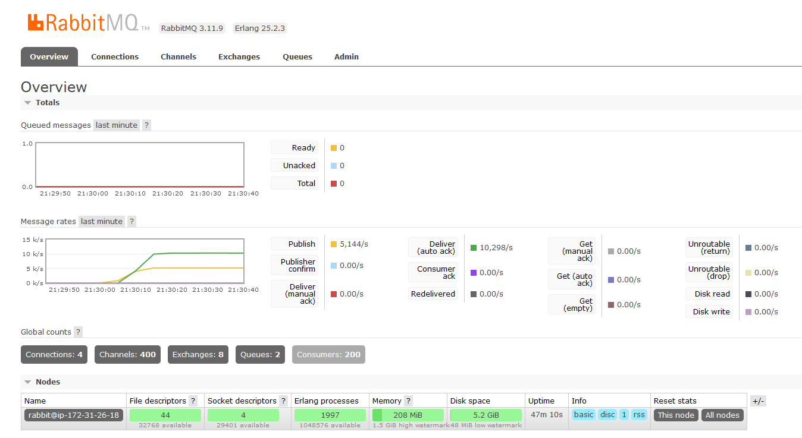
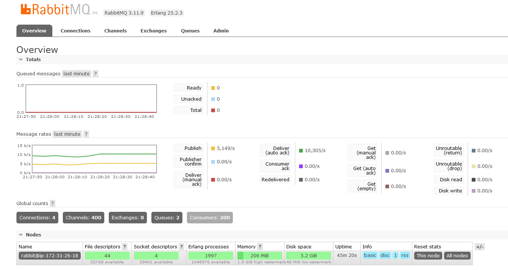
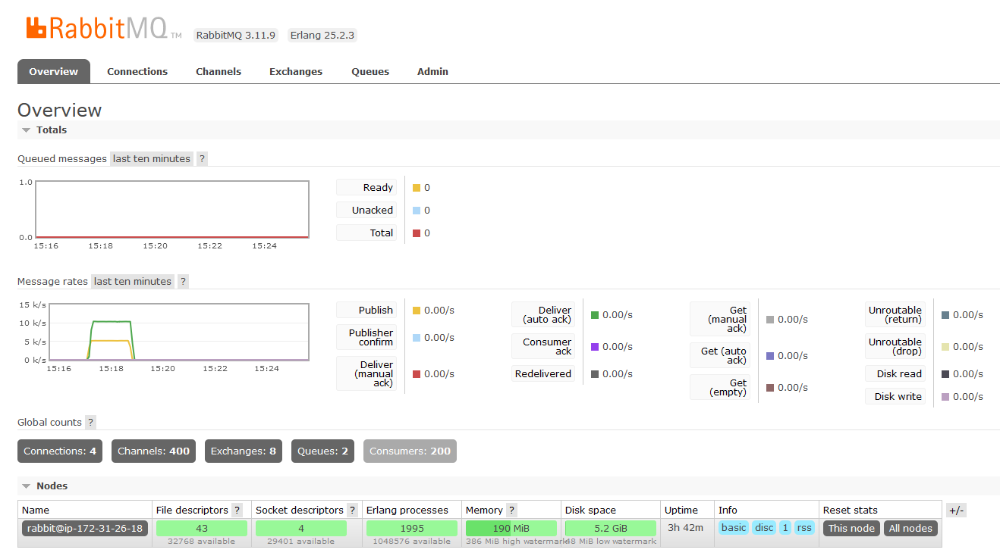
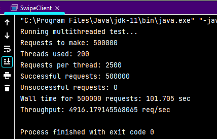

# CS6650 - Assignment 2

**Instructor:** Vishal Rajpal

**Student:** Jake Van Meter

## Project structure

1) The `a2_server` IntelliJ project directory contains the packages and classes for running the Java servlet on an EC2 instance.

2) The `a2_consumer` IntelliJ project directory contains the packages and classes for running the RabbitMQ consumers on an EC2 instance. I compiled them into jars and uploaded them to Ubuntu EC2 instances and ran them with the `java -jar a2_consumer` command.

3) The `a2_client` IntelliJ project directory contains the packages and classes for running the client on a laptop.

## Non-Load Balanced Metrics

<b>Start of publishing RabbitMQ broker metrics</b>:

<b>Middle of publishing RabbitMQ broker metrics</b>:

<b>Shape of message rates graph</b>:

<b>Connection metrics</b>:

- `54.185.208.4` = <b>publisher</b> (i.e. `SwipeServlet`)
- `44.231.192.218` = <b>consumer for liked_users_queue</b>
- `54.191.75.144` = <b>consumer for likes_and_dislikes_queue</b>

<b>Client throughput statistics</b>:

## Load Balanced Metrics

<b>Start of publishing RabbitMQ broker metrics</b>:

<b>Middle of publishing RabbitMQ broker metrics</b>:

<b>Shape of message rates graph</b>:

<b>Connection metrics</b>:

- `54.185.208.4` = <b>publisher 1</b> (i.e. `SwipeServlet`)
- `35.160.135.31` = <b>publisher 2</b> (i.e. `SwipeServlet`)
- `44.231.192.218` = <b>consumer for liked_users_queue</b>
- `54.191.75.144` = <b>consumer for likes_and_dislikes_queue</b>

<b>Client throughput statistics</b>:

## Reflections

From this we see that loadbalancing was effective at distributing the HTTP post requests from the client evenly across the two servlets. I got similar metrics when I tested both an application and network load balancer. Although the throughput wasn't quite doubled by increasing the client threadcount from 100 to 200, that could be due to increased serialization on the client side.

